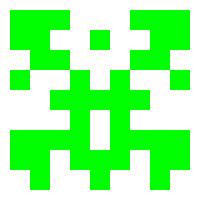

# Avatar-Generator
Generates random avatars that _look like_ GitHub's identicons. These are **not** actual identicons (yet?)!

## Usage

    go build
    ./avatargen --help
Output is `avatar.png`.

### Example
```
./avatargen --count=20 --size=30
```
<p align="center">

</p>

## Options

| options                                   |   Description                                                               | 
|-------------------------------------------|-----------------------------------------------------------------------------|
|`--count=<block count>`                    |   Number of blocks. Should be at least 2. By default, 5.                    |
|`--size=<block size>`                      |   Size of each block in pixels. Should be at least 2. By default, 70.       | 
|`--fgcolor=<hex value>`                    |   Color of each block in hex (000000-FFFFFF). By default, #64C8C8           |
|`--bgcolor=<hex value>`                    |   Background color in hex (000000-FFFFFF). By default, #FFFFFF              |
|`--output=<path>`                          |   Path of output file. By default, '_avatar.png_' in the current directory     |
